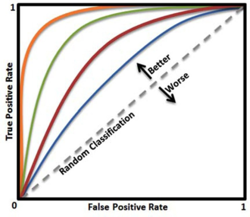
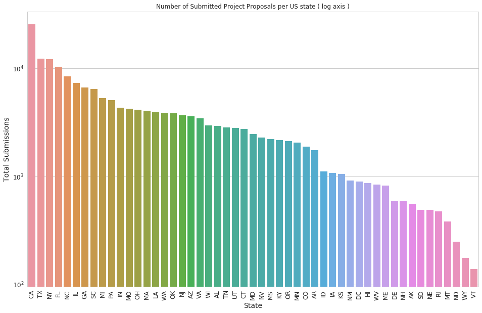
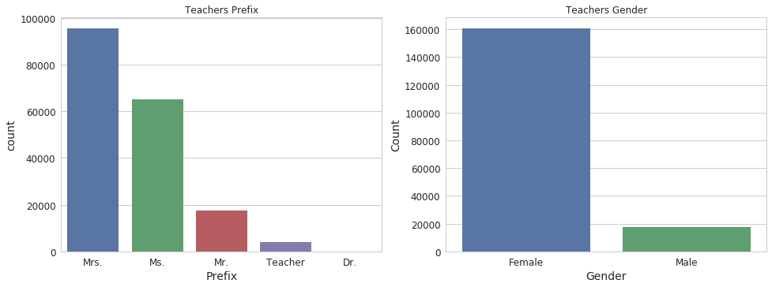
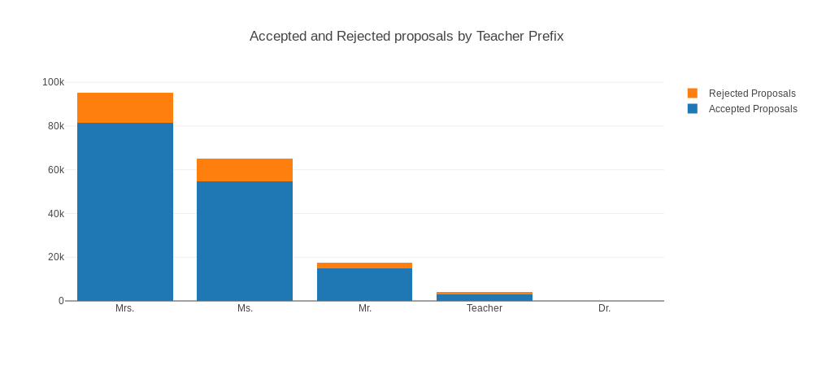
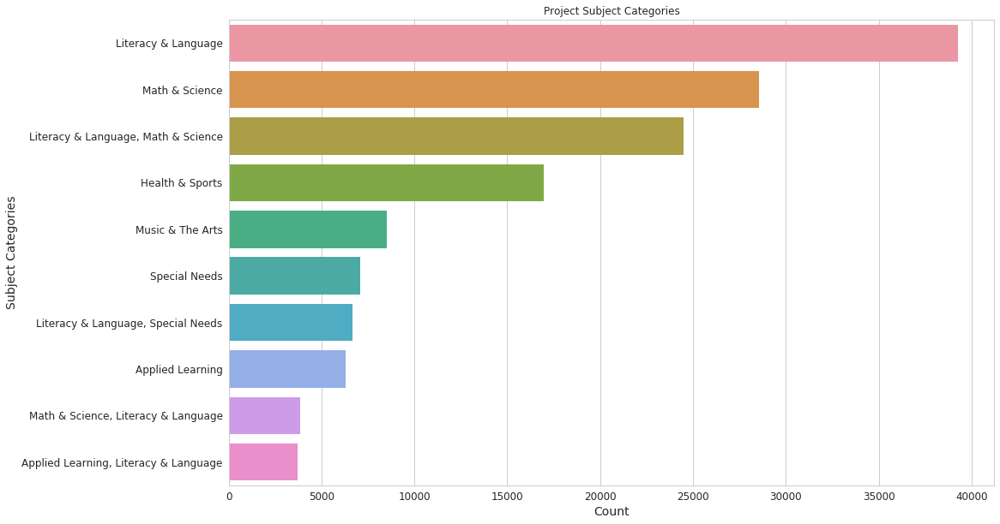
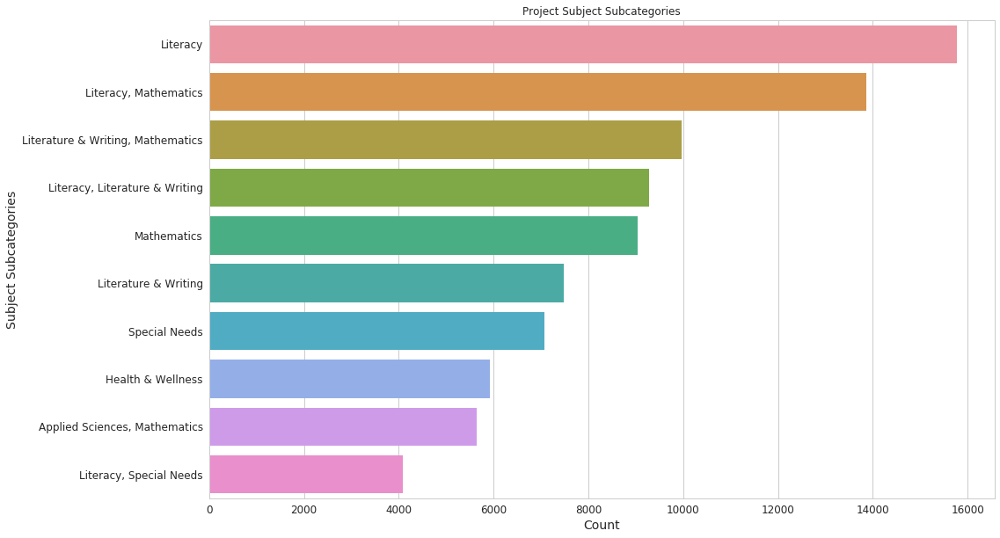
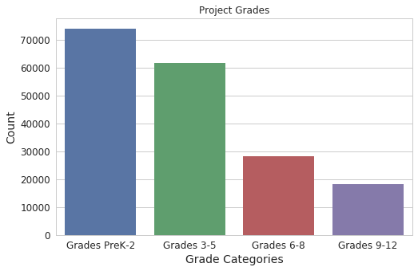
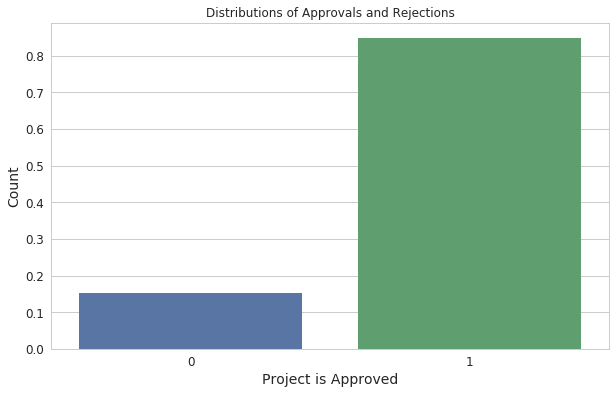
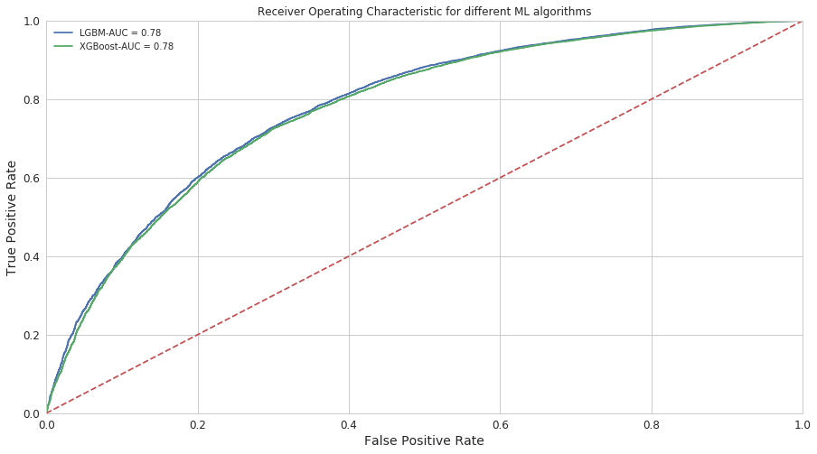

# Machine Learning Engineer Nanodegree - Capstone Project
## [DonorsChoose.org Application Screening](https://www.kaggle.com/c/donorschoose-application-screening)

## I. Definition

### Project Overview

Founded in 2000 by a high school teacher in the Bronx, [DonorsChoose.org](www.donorschoose.org) empowers public school teachers from across the country to request much-needed materials and experiences for their students. At any given time, there are thousands of classroom requests that can be brought to life with a gift of any amount.

DonorsChoose.org receives hundreds of thousands of project proposals each year for classroom projects in need of funding. Right now, a large number of volunteers is needed to manually screen each submission before it's approved to be posted on the DonorsChoose.org website. 

I intend to apply Data Science skills to help NGO's connected to poverty alleviation that's why this project is of interest to me, we need a lot more than food to achieve a just and prosper society and education is an immensely important asset for this goal.


### Problem Statement

Next year, DonorsChoose.org expects to receive close to 500,000 project proposals. As a result, there are three main problems they need to solve:

1. How to scale current manual processes and resources to screen 500,000 projects so that they can be posted as quickly and as efficiently as possible
2. How to increase the consistency of project vetting across different volunteers to improve the experience for teachers
3. How to focus volunteer time on the applications that need the most assistance

The goal is to predict whether or not a DonorsChoose.org project proposal submitted by a teacher will be approved, using the text of project descriptions as well as additional metadata about the project, teacher, and school. DonorsChoose.org can then use this information to identify projects most likely to need further review before approval.
With an algorithm to pre-screen applications, DonorsChoose.org can auto-approve some applications quickly so that volunteers can spend their time on more nuanced and detailed project vetting processes, including doing more to help teachers develop projects that qualify for specific funding opportunities.
The machine learning algorithm can help more teachers get funded more quickly, and with less cost to DonorsChoose.org, allowing them to channel even more funding directly to classrooms across the country.


### Metrics

The purpose of this project is to provide a [binary classification](https://en.wikipedia.org/wiki/Binary_classifier). As defined by the Problem Statement above, the biggest problem with manual classification is the scale of the task. Since the most important part is the ability to finance potentially good projects and not being held off by a failure to analyse them in time. In other words, the sensitivity - *True Positive Rates* - is the most important aspect. Good projects should be classified as such and approved, and the approval of bad projects should be as low as possible. The trade-off between Good Projects ( *True Positives* ) and bad projects wrongfully classified as good ones ( *False Positives* ) can be represented by the [Receiver operating characteristic](https://en.wikipedia.org/wiki/Receiver_operating_characteristic), i.e. ROC Curve: <br><br> . <br><br> It's a plot between the true positive rate ( sensitivity ) against the false positive rate (1 - specificity). The metric chosen by the organizers of the competition was the area under the ROC Curve -  AUC, so that what I used. This can be interpreted as: An uninformative classifier gives an AUC ~ 0.5. A valid and reliable classifier  ( AUC > 0.5 ) assigns a higher score to a randomly chosen Good Project and a lower score to a randomly chosen bad project.


## II. Analysis

### Data Exploration

#### Training and Test Data: File Structure and Content

**Note:** *The following three subsections are an adaptation from the quick-start guide provided by the Competition Organizers for a quick initial EDA and to set a benchmark.*
Reference: https://www.kaggle.com/skleinfeld/getting-started-with-the-donorschoose-data-set/notebook

The goal of the DonorsChoose competition is to build a model that can accurately predict whether a teacher's project proposal was accepted, based on the data they provided in their application. The `train.csv` data set provided by DonorsChoose contains the following features:

Feature | Description | Data Type
----------|---------------|------------
**`project_id`** | A unique identifier for the proposed project. **Example:** `p036502`   | string
**`project_title`**    | Title of the project. **Examples:**`Art Will Make You Happy!`, `First Grade Fun` | string
**`project_grade_category`** | Grade level of students for which the project is targeted. One of the following enumerated values: `Grades PreK-2`, `Grades 3-5`, `Grades 6-8`, `Grades 9-12`  | string
 **`project_subject_categories`** | One or more (comma-separated) subject categories for the project from the following enumerated list of values: `Applied Learning`, `Care & Hunger`, `Health & Sports`, `History & Civics`, `Literacy & Language`, `Math & Science`, `Music & The Arts`, `Special Needs`, `Warmth`. **Examples:** `Music & The Arts`, `Literacy & Language, Math & Science`  | string
  **`school_state`** | State where school is located ([Two-letter U.S. postal code](https://en.wikipedia.org/wiki/List_of_U.S._state_abbreviations#Postal_codes)). **Example:** `WY`| string
**`project_subject_subcategories`** | One or more (comma-separated) subject subcategories for the project. **Examples:** `Literacy`, `Literature & Writing`, `Social Sciences` | string
**`project_resource_summary`** | An explanation of the resources needed for the project. **Example:** `My students need hands on literacy materials to manage sensory needs!` | string
**`project_essay_1`**    | First paragraph of application essay.<sup>*</sup>  | string
**`project_essay_2`**    | Second paragraph of application essay.<sup>*</sup> | string
**`project_essay_3`**    | Third paragraph of application essay.<sup>*</sup> | string
**`project_essay_4`**    | Fourth paragraph of application essay.<sup>*</sup> | string
**`project_submitted_datetime`** | Datetime when project application was submitted. **Example:** `2016-04-28 12:43:56.245`   | int64
**`teacher_id`** | A unique identifier for the teacher of the proposed project. **Example:** `bdf8baa8fedef6bfeec7ae4ff1c15c56`  | string
**`teacher_prefix`** | Teacher's title. One of the following enumerated values: `nan`, `Dr.`, `Mr.`, `Mrs.`, `Ms.`, `Teacher.`  | string
**`teacher_number_of_previously_posted_projects`** | Number of project applications previously submitted by the same teacher. **Example:** `2` | int64


#### A Note on Essay Data

Prior to February 18th, 2010, for their DonorsChoose application, teachers had the option of writing either a free-form essay (split into `project_essay_1`, `project_essay_2`, `project_essay_3`, and `project_essay_4`) or writing free-form answers to the following four prompts:

1. Introduce your classroom (`project_essay_1`)
2. Describe the situation (`project_essay_2`)
3. Describe the solution (`project_essay_3`)
4. Empower your donors (`project_essay_4`) 

Effective February 18th, 2010, the option to write a free-form essay was removed, and all teachers were required to respond to the following four prompts:

1. Open with the challenge facing your students (`project_essay_1`)
2. Tell us more about your students (`project_essay_2`)
3. Inspire your potential donors with an overview of the resources you're requesting (`project_essay_3`)
4. Close by sharing why your project is so important (`project_essay_4`) 

When using essay data from `project_essay_1`, `project_essay_2`, `project_essay_3`, and `project_essay_4`, make sure to take into account that the nature of the text content in these fields is different for examples with a `project_submitted_datetime` prior to February 18th, 2010.


#### Label (the value you will attempt to predict):

* **`project_is_approved`** - A binary flag indicating whether DonorsChoose approved the project. A value of `0` indicates the project was not approved, and a value of `1` indicates the project was approved. (`int64`)


#### Additional Observations:

 * There is about 182k observations in our training set and 78k in our test set
 * **Teachers and School Information**: We have three categorical variables about the teachers and the school
   * `teacher_id` uniquely identify an individual teacher anonimously,
   *  `teacher_prefix` is probably an important categorical feature identifying gender (**4 missing values**)
   *  `school_state` is also categorical
 * **Project Information**: *3 Categorical Variables* describing the grade and subjects:
  * `project_grade_subcategory`, 
  * `project_subject_categories`, 
  * `project_subject_subcategories`
  
 and *2 textual ones*:
  * `project_title` 
  * `project_resource_summary`. 
  
 The former doesn't seem to be very useful in predicting the outcome, but the latter do, let's see.
 * **Project Essay**: This 4 additional textual features are the proposal's core and probably the most important variables. We'll need to make use of some nlp processing to make those useful.
 * The only numerical variable is `teacher_number_of_previously_posted_projects`
 * The null values are significant only in the columns `project_essay_3` and `project_essay_4`


#### Resources Data

Additionally, the `resources.csv` data set provides more data about the resources required for each project. Each line in this file represents a resource required by a project:

Feature | Description | Data Type
----------|---------------|------------
**`id`** | A `project_id` value from the `train.csv` file.  **Example:** `p036502`   | string
**`description`** | Desciption of the resource. **Example:** `Tenor Saxophone Reeds, Box of 25`   | string
**`quantity`** | Quantity of the resource required. **Example:** `3`   | string
**`price`** | Price of the resource required. **Example:** `9.95`   | string

**Note:** Many projects require multiple resources. The `id` value corresponds to a `project_id` in `train.csv`, so you use it as a key to retrieve all resources needed for a project


#### Exploratory Visualization

#### Space

Let's visualize the number of project proposals per state (the dynamic map is more interesting and can be seen in the notebook).



* California (CA) has the biggest number of proposals `25.695k`, followed by Texas (TX) with `12.304k` and New York with `12.157k`. Bare in mind that this is just the total number and it's not normalized by the population of each state or the number of schools and teachers. So a great deal of variance is normal.

Now let's see the same distribution of only the *approved submissions*:


The approvals distribution doesn't seem to differ too much from the submissions. There is no clear differences apart from the switch of positions between Texas and New York.


#### Teachers

Let's check the distribution of teachers by prefix and derive the gender distribution from this.



* There is a considerate dominance by women, around 90%
* Note: Since we can't determine the gender in `Dr.` and `"Teacher` I left those ones out in the graphical representation.
* Only 4 teachers in the `training`set doesn't have a Prefix.  I set those 4 to the most common prefix: `Mrs.`

Now we plot the distribution of gender in relation to approval rates:


* Ideally the approval of a project should be independent of gender, this seems to be the case on this data.


#### Project Categories and Grades
<br>



* We only showed the top 10 categories to keep the plot readable.
* The `subject_categories`are dominated by `Literacy & language` and `Math & Science` or a combination of one of them. `Health & Sports`, `Music & The Arts` and `Special Needs`are also numerous 



* The subcategories doesn't seem to add much information in relation to their parent category 



* There are more project proposals for younger students, which make perfect sense, since this age is deeply important as formative years of the child.
* Good teachers have to make the full use of their creativity to provide an optimal learning environment, and for this to happen a lot of projects and, naturally, more resources are needed.


#### Project Resource Summary

Let's plot a wordcloud showing the top resources needed.


* We see the focus on the text in the resources are student centered materials, such as 
  * electronics: `headphones, chromebook and ipad` 
  * books: `classroom library`
  * furniture: `flexible seating, Hokki stool, wobble chair`


#### Target Feature


 * The staggering majority of projects - `~85%` - are approved. This add a considerable imbalance to the analysis.


#### Algorithms and Techniques

Since we are in the final project of the course, there is no point in running multiple weak models to illustrate just for educational purpose and in the end execute only the strongest model. We are going to skip the first part because the majority of datasets can be best modeled with just two methods:

 * Ensembles of decision trees (i.e. Random Forests and Gradient Boosting Machines), mainly for structured data (such as you might find in a database table at most companies)
 * Multi-layered neural networks learnt with SGD (i.e. shallow and/or deep learning), mainly for unstructured data (such as audio, vision, and natural language)

I didn't apply Deep Learning ( It would probably be very succesful! ), since the load of work in this project was to make a comprehensive and original end-to-end application of Machine Learning, this enough took a considerable amount of time and dedication and a lot of independent study not only to handle, preprocess and feature engineer the data but also to succesfully apply the learning algorithm. 

A meaningful application of Deep Learning would require to apply specific NLP techniques not yet studied by me. Neither NLP nor enough Deep Learning were covered in detail in the Course , so I 've choosen to apply and study only one technique - `Gradient Boosted Trees` -  which is already very succesful in Competitions and this was my first one. The two implementations of `Boosted Trees` used were the [`XGBoost`](https://xgboost.readthedocs.io/en/latest/) and [`LightGBM`](https://lightgbm.readthedocs.io/en/latest/)


#### Boosted Trees

Boosted Trees are used for supervised learning problems such as regression and classification, like this one, under the general principle of the model being both **simple** and **predictive**. The tradeoff between the two is also referred as the *bias-variance* tradeoff in Machine Learning. The specifics of the algorithm and its mathematical formulation is beyond the scope of this report and is explained in the [documentation](https://xgboost.readthedocs.io/en/latest/). In summary, boosted trees consist of *tree emsembles*, i.e. a set of classification and regression trees (CART). It's a *set* because usually a single tree is not strong enough to be used in practice. The data points are classified into different leaves and it's assigned a score on the corresponding leaf. The different scores are combined, and the objective function optimized. 


#### Benchmark

The benchmark was given by the organizers and is a pretty simple one: Perform the learning on only one feature: `teacher_number_of_previously_posted_projects` and ignore all the others. The model used was a simple linear model and of course the score was pretty low, almost the same as chance: `AUC: 0.56`
<br>


### III. Methodology

#### Data Preprocessing

Decision trees don't necessarily require for us to perform any preprocessing, but in practice the training and performance are many times better if we do so. Considering the complex nature of the data set features, there is no way to know which feature is going to have predictive power, so as a **Feature Engineering** step we created a lot of additional features and let the model decide which one is informative. Boosted Trees normally can handle pretty well even thousands of features.

Since we have two separate data sets, a first step was to create additional categories from the `resources.csv` and then join the corresponding rows to `train.csv` and `test.csv`.


##### Resources

The features created from the resources data and joined to the other two were:

* `total_cost = quantity * price`
* Aggregating Quantities: `unique_items`,`total_quantity`,`mean_quantity`


##### Timestamps
The feature `project_submitted_datetime` was kept as a numerical category and from it we extracted some atomic information as additional categories: `year`, `month`, `day`, `day_of_week`, `hour`


##### Project Categories and Subcategories

This two features were actually a string composed of individual subjects, e.g.: `Literacy & Language = Literacy + Language`,`Math & Science = Math + Science`. The majority of them are composed of two parts, so each was dismembered in two columns and the original feature removed before training the model. 


##### Textual Features

Even considering the nature of the text features to be different one from the other, I decided to approach the NLP part of the project in a simpler way, since a comprehensive NLP processing is a whole other ML area. In that regard, the text feature were simply concatenated and treated as an individual feature to be preprocessed,  tokenized and vectorized.

* Original Text Features: `project_title`, `project_essay_1`, `project_essay_2`, `project_essay_3`, `project_essay_4`, `project_resource_summary`
* New feature: `project_essay`

Additional numerical features were created from each textual features: `length` and `word_count`


##### Numerical Encoding of Categorical Features and Feature Scaling of Numerical Ones

The *missing* values of categorical values were replace by the string `unknown` - in the Kaggle foruns some added that this can provide more information than just the empty string - and the *missing* numerical values were replaced by `0`. 
* Given the heterogeneity of the different features, existing and created, the scaling chosen was the `MinMaxScaler()`, to use the limits from the data instead of the normality assumption used in `StandardScaler()`.
* The normal preprocess of categorical variables is to Label Encode followed by One-Hot Encoding. But other point learned in Kaggle foruns is that Boosted Trees perform better with just Label Encoding instead of the more general One-Hot Encoding. So only Label Encoding was performed. 


##### Textual Cleaning and Tokenization

After the previous steps, our data is mostly numeric. The last feature to process is the big textual one. That's the NLP part of the project.

One common first step in NLP is to apply steemming, that is to extract the root, `steem`,  of the words, another one is to extract its `lemma`, the base form encountered in the dictionaries. 

From [Wikipedia](https://en.wikipedia.org/wiki/Lemmatisation):

 > The difference is that a stemmer operates on a single word without knowledge of the context, and therefore cannot discriminate between words which have different meanings depending on part of speech.<br>
 > ...<br>
 > For instance:
 > * The word "better" has "good" as its lemma. This link is missed by stemming, as it requires a dictionary look-up.
 > * The word "walk" is the base form for word "walking", and hence this is matched in both stemming and lemmatisation.
 > * The word "meeting" can be either the base form of a noun or a form of a verb ("to meet") depending on the context; e.g., "in our last meeting" or "We are meeting again tomorrow". Unlike stemming, lemmatisation attempts to select the correct lemma depending on the context.
 
 Steps of textual cleaning:
 
 * Regex cleaning and substitutions, e.g.: remove `\n`, `\r`, unusual punctuation and signs such as `_`, `+`, `=` etc.
 * `tokenization` - substitute the text by its `tokens` (individual words)
 * `lemmatization` - substitute the tokens for their `lemma`
 * Remove the *stop words* from the list above, because stop words are more textual fillers than informational


##### Vectorization of Textual Features

Finally, to meaningfully use text features in Supervised Learning Algorithm we need to vectorized them. The basic technique used was the **Term Frequency versus Inverse Document Frequency - TF-IDF**:

From [How does TF-IDF Work?](https://www.quora.com/How-does-TF-IDF-work):

 1. **TF Score (Term Frequency)**:
 Considers documents as bag of words, agnostic to order of words. A document with 10 occurrences  of the term is more relevant than a document with term frequency 1. But it is not 10 times more  relevant, relevance is not proportional to frequency
 2. **IDF Score (Inverse Document Frequency)**:
    We also want to use the frequency of the term in the collection for weighting and ranking.   Rare terms are more informative than frequent terms. We want low positive weights for frequent  terms and high weights for rare terms.
    
Combining these two we come up with a `tf` score and an `idf score`. We calculate these scores in the log-scale:

The log term frequency of a term `t` in document `d` is defined as

$$1+log(1+tf_{t,d})$$

The log inverse document frequency which measures the informativeness of a term is defined as:

$$ idf_{t} = log_{10} \frac {N}{df_t} $$

where `N` is the total number of documents in the collection

Combining the two, the `tf-idf` score is given by:

$$ w_{t,d} =[1+log(1+tf_{t,d})] log_{10} \frac {N}{df_t} $$

* The `tf-idf` score increases with the  number of occurrences within a document
* The `tf-idf` score increases with rarity of terms in the collection

The `TfidfVectorizer` from `sklearn`was used for this.

The parameters applied were based on the excellent article from the Kaggle Master *Abhishek Thakur* [Approaching (Almost) Any Machine Learning Problem](http://www.kaggle.com/abhishek/approaching-almost-any-nlp-problem-on-kaggle)


#### Implementation

Given the limitation of not using a state-of-the-art DNN model in this project, I decided to take the ensemble idea one step further and stacked two different implementation of `Boosted Trees`:</br>

* The traditinal `XGBoost` which uses Level-wise tree growth: </br>.</br>
* The  [`LightGBM`](https://lightgbm.readthedocs.io/en/latest), which constructs the tree by Leaf-wise (Best-first) Tree Growth: </br>. </br> 
 
The boosting technique used in `LightGBM`was [DART: Dropouts meet Multiple Additive Regression Trees](https://arxiv.org/abs/1505.01866), different from the traditional `gbdt` used in xgboost. This way I have two different ensembles of Decision Trees with different tree growth algorithms and different boosting techniques.

Running only `xgboost` with the default hyperparameters, the validation score was in the range `AUC: ~ 0.65 ~ 0.67`, but the training score was around `0.89`. Therefore a considerable overfitting was present. A major hyperparameter tuning is necessary.


#### Refinement


To refine the `xgboost` algorithm, my original attempt was to follow the hyperparameter tunning procedure detailed in the article [Complete Guide to Parameter Tuning in XGBoost (with codes in Python)](https://www.analyticsvidhya.com/blog/2016/03/complete-guide-parameter-tuning-xgboost-with-codes-python/).
Since the xgboost library has its own cross validation, the procedure was to use the sklearn wrapper `XGBClassifier` to perform hyperparameter tuning using sklearn’s `GridSearchCV` with parallel processing. 
Nevertheless, even after compiling xgboost with GPU support, I've failed repeatedly to make use of `GridSearchCV` or `RandomSearchCV` from `sklearn`, even in a 8CPU, Tesla K80 GPU and 30GB RAM the code kept running out of memory.
So I decided to use hyperparameters values more or less well stablished by the vastly experienced community of Kaggle Competitors and Grand Masters. Even if I found very different hyperparameters, they would probably be overfitting anyway. 

After running several times the two models with different hyperparameters, the final parameters with the best score and least overfitting were: 

```python

params_xgb = {"eta": 0.05, 
              "gamma": 0,
              "max_depth": 7, 
              "min_child_weight": 1,
              "subsample": 0.8,
              "colsample_bytree": 0.8,
              "reg_lambda": 1,
              'objective': 'binary:logistic',
              'eval_metric': 'auc',
              'scale_pos_weight': ratio,
              #'tree_method': 'gpu_hist', # Used if compiled with gpu support
              'num_threads': 4,
              'seed': 42}

params_lgb = {'boosting_type': 'dart',
              'objective': 'binary',
              'metric': 'auc',
              'max_depth': 14,
              'learning_rate': 0.05,
              'feature_fraction': 0.85,
              'bagging_fraction': 0.85,
              'scale_pos_weight': ratio,
              'seed': 42,
              'bagging_freq': 5,
              'min_data_in_leaf' : 1,
              'lambda_l2': 1.0,
              'max_bin': 63,
              'min_gain_to_split': 0,
              'num_threads': 4
              # 'device': 'gpu' # Used if compiled with gpu support
    }
```

### IV. Results

#### Model Evaluation and Validation

Since our data is very imbalanced: ~85% ratio of *approved vs non-approved*, it's important to deal with this in our cross-validation. One approach is to use `StratifiedKFold`. But since both implementations of Gradient Boosted Trees used have a hyperparameter `scale_pos_weight`, which takes into account the imbalance, no  stratification was done in the cross-validation. 

5-Fold cross validation training were performed with different random training and validation sets from sklearn's `train-test_split`. One great aspect of those two algorithms is the parameter `early_stopping_rounds`. This parameter determine the maximum number of boosting rounds the model will run if the validation score doesn't improve. So we can set a high number of boosting rounds and the model will keep running as long as the validation score is improving.

The predictions on the test set from each fold of the 2 models were combined in a numpy array and a simple Linear regression was performed to blend the 2 predictions and put in a list. A MinMaxScaler() of this 5 folds were performed as a final prediction on the test set.


#### Final Model and Justification 

Even after extensive trial-and-error on the hyperparameters of `xgboost` the model was still showing a considerable overfitting: *training score much higher than validation score*. The `lightgbm` model didn't have this problem. The final prediction of this ensemble was submitted to Kaggle and got a Public Score of `AUC: 0.77056`

Finally I decided to drop the `xgboost` model, given the overfitting, and use just the 5-fold ensemble of `lightgbm` to make predictions on the test set and submit again to Kaggle. 

This second choice got a Public Score of `AUC: 0.78157` and it was my final submission in the competition. Nevertheless this submission is not present in the notebook, only the first one.


#### ROC-AUC Curve

.

### V. Conclusion

#### Reflection

This project was extremely interesting because of the mixture of categorical, numerical and heavy textual features. In addition the cause is fantastic. A total of 581 teams participated and I learned a lot from the discussions and from the amazing notebooks of other contestants. I encountered great difficulty when dealing with the high dimensions of the data set resulting from the vectorization of textual features. Working in an instance of Google Cloud with GPU support and lots of memory diminished my frustration a bit but in the end I could make it work by just using an i-5 dell laptop with 8GB RAM. 

The Public Score is evaluated on only 30% of the data, the remaining 70% is evaluated only after the competition is over.

My final score and classification, after the competition was over, was: [`AUC: 0.77431` and `248th`](https://www.kaggle.com/c/donorschoose-application-screening/leaderboard) of a total 581 teams. Since this result is similiar to the validation scores founded during training, the result is robust to unseen data and also gives enough margin to help in making a decision given a new submission. 

I considered this an extremely successful result for a first competition, be in the upper `42.8%`.


#### Improvement

Deep Learning Models is clearly the current state-of-art in Machine Learning, not using it in this project was a major limitation. The [1st place](https://www.kaggle.com/shadowwarrior/1st-place-solution) solution got a final score of `AUC: 0.82812`. A difference of less than `0.05` puts me in the `248th` position. We can see that is very difficult to achieve even a minor improvement in performance without putting a lot of further work. After the end of the competition, the winner revealed his model, most of it is beyond my current comprehension:

[An ensemble of state-of-art Deep Learning Models as well as Gradient Boosting Trees:](https://www.kaggle.com/shadowwarrior/1st-place-solution)

* `GRU-ATT` and `GRU-LSTM` models. Each model with different word embeddings or had their sentences reversed (a kind of data augmentation)
* `Bi-LSTM` with different word embeddings and *feature hashing* 
* Capsule Network models.
* Combined `Bi-GRU` and `Conv1D` models
* `LGB` model of depth 17
* `XGB` model of depth 7 (shallow x LGB's deep)
* Different feature engineering for different models.


